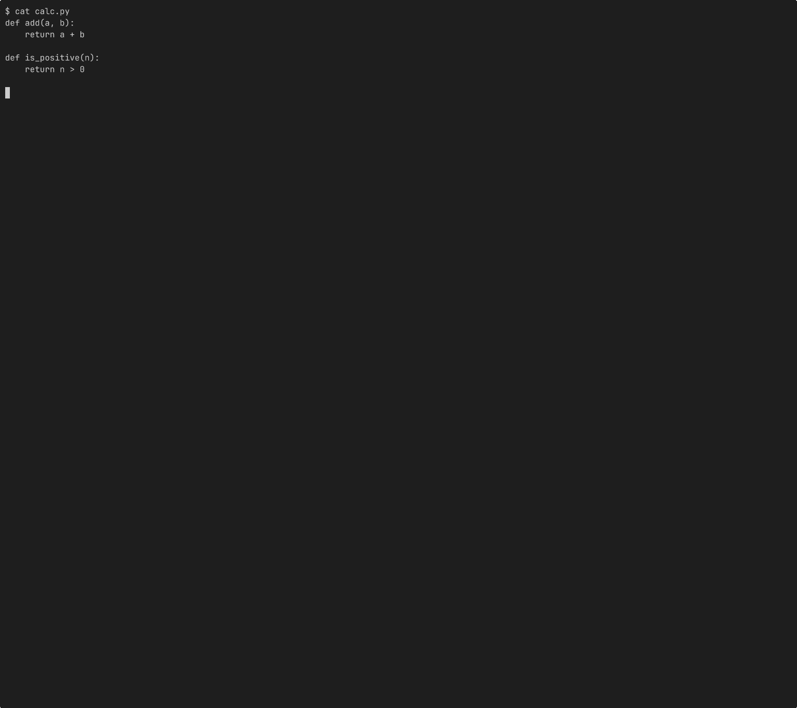

# agent-mutator

**Mutation testing CLI built for AI coding agents.**

Validates that your tests actually catch bugs. Supports Python, JavaScript, TypeScript, and Rust.

[](https://github.com/flimble/agent-mutator/actions/workflows/ci.yml)
[](https://github.com/flimble/agent-mutator)
[](https://github.com/flimble/agent-mutator)
[](LICENSE)



---

## Why

Tests that pass don't prove anything. A test suite can have 100% coverage and still miss real bugs.

Mutation testing answers: **if I break this code, do the tests notice?**

agent-mutator introduces small changes (mutants) to your source code and runs your tests against each one. If a test fails, the mutant is killed. If tests still pass, the mutant survived and your tests have a gap.

```
mutator run app.py -t test_app.py -f calculate_total --json
```

```json
{"score":0.85,"total":20,"killed":17,"survived":3,"timeout":0,"unviable":0}
```

Three mutants survived. Your tests miss 15% of possible bugs in `calculate_total`.

## Installation

### Homebrew (macOS)

```
brew install flimble/tap/agent-mutator
```

### From source

```
git clone https://github.com/flimble/agent-mutator.git
cd agent-mutator
cargo build --release
./install.sh  # symlinks to ~/.local/bin/mutator
```

Requires [Rust](https://rustup.rs).

## Quick Start

```
# Python (default test command: pytest)
mutator run src/app.py -t tests/test_app.py --json

# Scope to a single function (recommended, much faster)
mutator run src/app.py -t tests/test_app.py -f calculate_total --json

# JavaScript / TypeScript
mutator run src/utils.ts -t tests/utils.test.ts --test-cmd "npx vitest run" --json

# Rust
mutator run src/parser.rs -t tests/test_parser.rs --test-cmd "cargo test" --json

# Check what survived
mutator show @m1

# Summary of last run
mutator status
```

## Commands

| Command | Description |
|---|---|
| `mutator run <file> -t <test>` | Run mutation testing |
| `mutator show @m1` | Show details for survived mutant |
| `mutator status` | Summary of last run |

### Run Options

| Flag | Description |
|---|---|
| `-f <function>` | Scope mutations to a single function (recommended) |
| `--json` | JSON output for machine consumption |
| `-q` | Exit code only (0 = all killed, 1 = survivors) |
| `--test-cmd <cmd>` | Override test runner (default: `pytest`) |
| `--session <id>` | Named session for temp dir isolation |
| `--timeout-mult <n>` | Timeout multiplier (default: 3x baseline) |
| `--in-place` | Mutate source in-place (unsafe for concurrent use) |

## Supported Languages

| Language | Extensions | Default test command |
|---|---|---|
| Python | `.py` | `pytest` |
| JavaScript | `.js`, `.mjs`, `.cjs` | (set via `--test-cmd`) |
| TypeScript | `.ts`, `.mts`, `.cts` | (set via `--test-cmd`) |
| TSX/JSX | `.tsx`, `.jsx` | (set via `--test-cmd`) |
| Rust | `.rs` | (set via `--test-cmd`) |

## Mutation Operators

agent-mutator applies these mutation types:

| Operator | Example | Description |
|---|---|---|
| Arithmetic | `+` to `-` | Swap math operators |
| Comparison | `>` to `>=` | Boundary and negation |
| Logical | `and` to `or` | Flip boolean logic |
| Boolean | `True` to `False` | Flip literals |
| Negation | `not x` to `x` | Remove negation |
| Return value | `return x` to `return None` | Change return values |
| String | `"hello"` to `""` | Empty/mutate strings |
| Block removal | `if x: body` to `if x: pass` | Remove conditional bodies |
| Membership | `in` to `not in` | Flip containment checks |
| Identity | `is` to `is not` | Flip identity checks |

## How It Works

1. **Parse** the source file with tree-sitter to find mutable code
2. **Baseline** run your tests to get timing and confirm they pass
3. **Copy** the project tree to a temp directory (isolation)
4. For each mutation: **apply** the change, **run** tests, **record** result
5. Report score and list surviving mutants

The default mode never modifies your original source. Each mutation runs in an isolated copy.

## Usage with AI Agents

### Just ask

Tell your agent to use mutator after writing tests:

```
Run mutator to check if these tests actually catch bugs:
mutator run src/app.py -t tests/test_app.py -f my_function --json
```

### AI Coding Assistants

agent-mutator ships with an agent skill in `skills/agent-mutator/`. Copy it to your project or personal skills directory for richer context.

### AGENTS.md

Add to your project instructions:

```
## Test Quality
After writing tests, validate with mutation testing:
mutator run <source> -t <test> -f <function> --json
Score of 1.0 = all mutants killed. Below 0.8 = improve tests.
Use `mutator show @m1` to inspect survivors.
```

## Development

```
git clone https://github.com/flimble/agent-mutator.git
cd agent-mutator
cargo test              # all 252 tests
cargo test --lib        # unit tests only
cargo test --test test_e2e  # e2e tests (needs pytest)
```

## License

MIT -- see [LICENSE](LICENSE).
